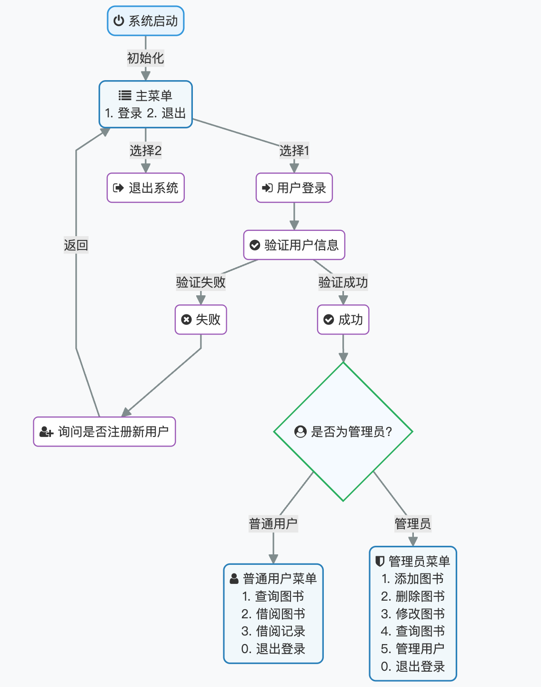
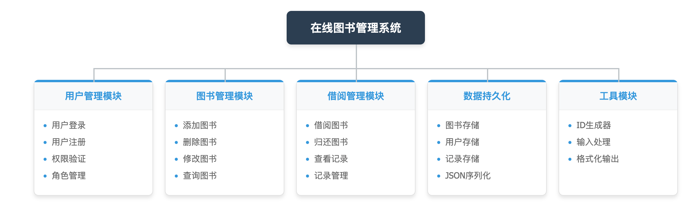

## 课题：在线图书管理系统

---

## 1. 系统需求分析

### 1.1 系统设计目的与意义

随着信息化时代的发展，传统的图书管理方式已经无法满足现代图书馆的需求。本系统旨在设计一个基于 Java 的在线图书管理系统，实现图书信息的电子化管理，提高图书馆的工作效率和服务质量。

**设计目的：**

1. 掌握 Java 语言的基本语法和面向对象编程思想
2. 掌握类与对象、继承、封装、多态等面向对象特性
3. 掌握异常处理、集合框架、文件读写等 Java 高级语法
4. 培养分析问题和解决问题的能力

**设计意义：**

1. 实现图书信息的统一管理，便于查询和维护
2. 实现借阅流程的规范化，提高管理效率
3. 支持多角色用户管理，满足不同用户的需求
4. 数据持久化存储，保证数据安全可靠

### 1.2 系统功能需求

#### 1.2.1 用户角色需求

系统支持两种用户角色：

- **普通用户（User）**：可以查询图书、借阅图书、查看和管理个人借阅记录
- **管理员（Admin）**：可以对图书进行增删改查操作，管理用户信息

#### 1.2.2 功能需求列表

| 功能模块      | 普通用户 | 管理员 |
| ------------- | -------: | -----: |
| 用户登录/注册 |       ✓ |     ✓ |
| 查询图书      |       ✓ |     ✓ |
| 借阅图书      |       ✓ |     ✗ |
| 查看借阅记录  |       ✓ |     ✗ |
| 归还图书      |       ✓ |     ✗ |
| 添加图书      |       ✗ |     ✓ |
| 删除图书      |       ✗ |     ✓ |
| 修改图书信息  |       ✗ |     ✓ |
| 用户管理      |       ✗ |     ✓ |

#### 1.2.3 系统流程图



### 1.3 输入输出要求

**输入要求：**

- 用户名和密码：字符串类型，用于登录验证
- 图书信息：包括 ID、书名、作者、分类、数量等
- 操作选择：通过数字或关键字进行菜单选择

**输出要求：**

- 操作结果提示：成功或失败信息
- 图书信息列表：格式化显示图书详情
- 借阅记录：显示借阅状态、日期等信息

---

## 2. 总体设计

### 2.1 系统功能分析

本系统采用分层架构设计，主要分为以下几个层次：

1. **表示层（Presentation Layer）**：负责用户交互，接收用户输入并显示结果
2. **业务逻辑层（Business Logic Layer）**：处理核心业务逻辑，如登录验证、借阅管理等
3. **数据访问层（Data Access Layer）**：负责数据的持久化存储和读取
4. **模型层（Model Layer）**：定义系统中的数据实体类

### 2.2 系统功能模块划分与设计

#### 2.2.1 系统功能模块图



#### 2.2.2 模块功能说明

| 模块名称       | 功能描述                                                 |
| -------------- | -------------------------------------------------------- |
| 用户管理模块   | 负责用户的登录、注册、权限验证，区分普通用户和管理员角色 |
| 图书管理模块   | 管理员对图书进行增删改查操作，支持关键字模糊搜索         |
| 借阅管理模块   | 处理图书借阅和归还业务，管理借阅记录                     |
| 数据持久化模块 | 使用 JSON 格式将数据存储到文件，支持数据的读取和保存     |
| 工具模块       | 提供 ID 生成、输入处理等通用功能                         |

---

## 3. 详细设计

### 3.1 类层次图

```

                    ┌─────────────┐

                    │   Object    │

                    └──────┬──────┘

                           │

         ┌─────────────────┼─────────────────┐

         │                 │                 │

    ┌────▼────┐      ┌─────▼─────┐     ┌─────▼─────┐

    │  User   │      │   Book    │     │BorrowRecord│

    └────┬────┘      └───────────┘     └───────────┘

         │

    ┌────▼────┐

    │  Admin  │

    │(extends │

    │  User)  │

    └─────────┘


  ┌─────────────────┐       ┌─────────────┐

  │ LibrarySystem   │       │ IdGenerator │

  │   (service)     │       │   (utils)   │

  └─────────────────┘       └─────────────┘

```

### 3.2 各类详细设计

#### 3.2.1 Book 类（图书类）

**包路径：** `model.Book`

**类图：**

```

┌────────────────────────────────────┐

│              Book                  │

├────────────────────────────────────┤

│ - id: String        // 图书ID      │

│ - title: String     // 书名        │

│ - author: String    // 作者        │

│ - category: String  // 分类        │

│ - copies: int       // 可借副本数   │

├────────────────────────────────────┤

│ + Book()                           │

│ + Book(id, title, author,          │

│        category, copies)           │

│ + getId(): String                  │

│ + getTitle(): String               │

│ + setTitle(title): void            │

│ + getAuthor(): String              │

│ + setAuthor(author): void          │

│ + getCategory(): String            │

│ + setCategory(category): void      │

│ + getCopies(): int                 │

│ + setCopies(copies): void          │

│ + toString(): String               │

│ + equals(o): boolean               │

│ + hashCode(): int                  │

└────────────────────────────────────┘

```

**关键代码：**

```java

packagemodel;


publicclass Book {

privateString id;        // 图书唯一标识

privateString title;     // 书名

privateString author;    // 作者

privateString category;  // 分类

privateint copies;       // 可借副本数


// 构造方法

publicBook(Stringid, Stringtitle, Stringauthor, Stringcategory, intcopies) {

        this.id = id;

        this.title = title;

        this.author = author;

        this.category = category;

        this.copies = copies;

    }


// 格式化输出

    @Override

publicStringtoString() {

return String.format("[%s] %s — %s | %s | 可借: %d",

                id, title, author, category, copies);

    }

}

```

#### 3.2.2 User 类（用户基类）

**包路径：** `model.User`

**类图：**

```

┌────────────────────────────────────┐

│              User                  │

├────────────────────────────────────┤

│ # id: String        // 用户ID      │

│ # username: String  // 用户名      │

│ # password: String  // 密码        │

│ # role: String      // 角色        │

├────────────────────────────────────┤

│ + User()                           │

│ + User(id, username, password,     │

│        role)                       │

│ + showMenu(): void                 │

│ + searchBooks(system): void        │

│ + borrowBook(system): void         │

│ + viewBorrowRecords(system): void  │

│ + matchesKeyword(book, key):       │

│                         boolean    │

│ + getter/setter methods...         │

└────────────────────────────────────┘

```

**关键代码：**

```java

packagemodel;


publicclass User {

protectedString id;

protectedString username;

protectedString password;

protectedString role;


// 显示用户菜单，子类可重写

publicvoidshowMenu() {

        System.out.println("\n=== 普通用户菜单 ===");

        System.out.println("1. 查询图书");

        System.out.println("2. 借阅图书");

        System.out.println("3. 查看借阅记录");

        System.out.println("0. 退出登录");

    }


// 借阅图书方法

publicvoidborrowBook(LibrarySystemsystem) {

// 处理借阅逻辑，支持关键字搜索

// 创建借阅记录并保存

    }

}

```

#### 3.2.3 Admin 类（管理员类）

**包路径：** `model.Admin`

**类图：**

```

┌────────────────────────────────────┐

│         Admin extends User         │

├────────────────────────────────────┤

│ (继承User的所有属性)                │

├────────────────────────────────────┤

│ + Admin(username, password)        │

│ + Admin(id, username, password)    │

│ + showMenu(): void    // 重写      │

│ + addBook(system): void            │

│ + removeBook(system): void         │

│ + updateBook(system): void         │

└────────────────────────────────────┘

```

**关键代码：**

```java

packagemodel;


publicclass Admin extendsUser {


publicAdmin(Stringid, Stringusername, Stringpassword) {

        super(id, username, password, "ADMIN");

    }


    @Override

publicvoidshowMenu() {

        System.out.println("\n=== 管理员菜单 ===");

        System.out.println("1. 添加图书");

        System.out.println("2. 删除图书");

        System.out.println("3. 修改图书信息");

        System.out.println("4. 查询图书");

        System.out.println("5. 管理用户");

        System.out.println("0. 退出登录");

    }


// 添加图书

publicvoidaddBook(LibrarySystemsystem) {

// 获取用户输入，创建新图书并保存

    }

}

```

#### 3.2.4 BorrowRecord 类（借阅记录类）

**包路径：** `model.BorrowRecord`

**类图：**

```

┌────────────────────────────────────┐

│          BorrowRecord              │

├────────────────────────────────────┤

│ - id: String         // 记录ID     │

│ - bookId: String     // 图书ID     │

│ - username: String   // 借阅用户   │

│ - borrowDate: String // 借阅日期   │

│ - dueDate: String    // 应还日期   │

│ - returnDate: String // 归还日期   │

│ - status: String     // 状态       │

├────────────────────────────────────┤

│ + BorrowRecord(...)                │

│ + getter/setter methods...         │

│ + toString(): String               │

│ + equals(o): boolean               │

│ + hashCode(): int                  │

└────────────────────────────────────┘

```

**关键代码：**

```java

packagemodel;


publicclass BorrowRecord {

privatefinalString id;          // 记录ID

privatefinalString bookId;      // 图书ID

privatefinalString username;    // 借阅用户

privatefinalString borrowDate;  // 借阅日期

privatefinalString dueDate;     // 应还日期

privateString returnDate;        // 归还日期，null表示未归还

privateString status;            // BORROWED或RETURNED


    @Override

publicStringtoString() {

return String.format("[%s] %s | 用户: %s | 借出: %s | 应还: %s | 归还: %s | 状态: %s",

            id, bookId, username, borrowDate, dueDate,

            returnDate ==null?"-": returnDate, status);

    }

}

```

#### 3.2.5 LibrarySystem 类（系统核心类）

**包路径：** `service.LibrarySystem`

**类图：**

```

┌──────────────────────────────────────────┐

│            LibrarySystem                 │

├──────────────────────────────────────────┤

│ - scanner: Scanner                       │

│ - books: Map<String, Book>               │

│ - records: Map<String, BorrowRecord>     │

│ - users: Map<String, User>               │

│ - booksFile: Path                        │

│ - recordsFile: Path                      │

│ - usersFile: Path                        │

│ - gson: Gson                             │

├──────────────────────────────────────────┤

│ + LibrarySystem()                        │

│ + start(): void                          │

│ + getScanner(): Scanner                  │

│ + getBooks(): Map<String, Book>          │

│ + getRecords(): Map<String, BorrowRecord>│

│ + listAllBooksAndWait(): void            │

│ + readIntOrDefault(def): int             │

│ + waitForEnter(prompt): void             │

│ - login(): void                          │

│ - adminLoop(admin): void                 │

│ - userLoop(user): void                   │

│ - loadBooks(): void                      │

│ + saveBooks(): void                      │

│ - loadRecords(): void                    │

│ + saveRecords(): void                    │

│ - loadUsers(): void                      │

│ + saveUsers(): void                      │

└──────────────────────────────────────────┘

```

**关键代码：**

```java

packageservice;


publicclass LibrarySystem {

privatefinalScanner scanner;

privatefinalMap<String, Book> books =newLinkedHashMap<>();

privatefinalMap<String, BorrowRecord> records =newLinkedHashMap<>();

privatefinalMap<String, User> users =newLinkedHashMap<>();

privatefinalGson gson;


publicLibrarySystem() {

        this.scanner =newScanner(System.in);

        this.gson =newGsonBuilder().setPrettyPrinting().create();

loadBooks();

loadRecords();

loadUsers();

// 确保至少有一个管理员

if (users.values().stream().noneMatch(u ->"ADMIN".equals(u.getRole()))) {

User admin =newAdmin("U-00000001", "admin", "admin");

            users.put(admin.getId(), admin);

saveUsers();

        }

    }


// 系统启动入口

publicvoidstart() {

while (true) {

            System.out.println("=================================");

            System.out.println("      欢迎使用在线图书管理系统      ");

            System.out.println("=================================");

// 显示主菜单并处理用户选择

        }

    }

}

```

#### 3.2.6 IdGenerator 类（ID 生成器）

**包路径：** `utils.IdGenerator`

**类图：**

```

┌────────────────────────────────────┐

│          IdGenerator               │

├────────────────────────────────────┤

│ - RANDOM: Random                   │

├────────────────────────────────────┤

│ + generateRandom8DigitString():    │

│                           String   │

│ + generateId(prefix): String       │

└────────────────────────────────────┘

```

**关键代码：**

```java

packageutils;


publicclass IdGenerator {

privatestaticfinalRandom RANDOM =newRandom();


// 生成8位随机数字字符串

publicstaticStringgenerateRandom8DigitString() {

return String.format("%08d", RANDOM.nextInt(100000000));

    }


// 生成带前缀的8位随机ID

publicstaticStringgenerateId(Stringprefix) {

return prefix +generateRandom8DigitString();

    }

}

```

### 3.3 数据持久化设计

系统使用 JSON 格式进行数据持久化存储，主要包含三个数据文件：

| 文件名                | 存储内容 | 数据结构              |
| --------------------- | -------- | --------------------- |
| `data/books.json`   | 图书信息 | Book 对象数组         |
| `data/users.json`   | 用户信息 | User 对象数组         |
| `data/records.json` | 借阅记录 | BorrowRecord 对象数组 |

**数据文件示例：**

books.json:

```json
[
  {
    "id": "B-48291730",

    "title": "算法导论",

    "author": "Thomas H. Cormen",

    "category": "计算机",

    "copies": 5
  }
]
```

users.json:

```json
[
  {
    "id": "U-00000001",

    "username": "admin",

    "password": "admin",

    "role": "ADMIN"
  }
]
```

records.json:

```json
[
  {
    "id": "B-U-00000002-94083649",

    "bookId": "B-81407963",

    "username": "user",

    "borrowDate": "2025-12-24",

    "dueDate": "2026-01-07",

    "returnDate": "2025-12-24",

    "status": "RETURNED"
  }
]
```

### 3.4 面向对象特性应用

#### 3.4.1 封装

- 所有实体类的属性都设置为 private，通过 getter/setter 方法访问

-`LibrarySystem`类封装了数据加载和保存的实现细节

-`IdGenerator`类封装了 ID 生成算法

#### 3.4.2 继承

-`Admin`类继承自 `User`类，复用了用户的基本属性和方法

- 子类 Admin 扩展了管理员特有的功能（添加、删除、修改图书）

#### 3.4.3 多态

-`showMenu()`方法在 `User`和 `Admin`类中有不同实现

- 系统根据用户角色动态调用相应的菜单显示方法

-`searchBooks()`方法在两个角色中共用，体现了多态的复用性

---

## 4. 系统调试

### 4.1 编译问题及解决

#### 问题 1：Gson 库依赖缺失

**错误信息：** `error: package com.google.gson does not exist`

**解决方案：** 在项目 lib 目录下添加 gson 库的 jar 包，并配置编译路径。

#### 问题 2：类型擦除导致的泛型问题

**错误信息：** 使用 `TypeToken`进行 JSON 反序列化时类型推断失败

**解决方案：** 使用匿名内部类方式创建 TypeToken：

```java

Type listType =newTypeToken<ArrayList<Book>>(){}.getType();

List<Book> list = gson.fromJson(content, listType);

```

### 4.2 运行逻辑问题及调整

#### 问题 1：用户登录后角色判断不准确

**现象：** 管理员登录后显示普通用户菜单

**原因：** 从 JSON 反序列化后，Admin 对象被还原为 User 类型

**解决方案：** 在 loadUsers()方法中，根据 role 字段重新构建 Admin 对象：

```java

if ("ADMIN".equals(u.getRole())) {

    users.put(u.getId(), newAdmin(u.getId(), u.getUsername(), u.getPassword()));

} else {

    users.put(u.getId(), u);

}

```

#### 问题 2：借阅时图书副本数未正确扣减

**现象：** 借阅成功但图书可借数量未减少

**原因：** 修改后的 Book 对象未保存到文件

**解决方案：** 在借阅操作后立即调用 `saveBooks()`方法保存数据。

#### 问题 3：关键字搜索大小写敏感

**现象：** 搜索"Java"找不到标题为"java"的图书

**解决方案：** 在 matchesKeyword 方法中统一转换为小写进行比较：

```java

keyword = keyword.toLowerCase();

return (book.getTitle() !=null&& book.getTitle().toLowerCase().contains(keyword));

```

#### 问题 4：用户输入空字符串时系统崩溃

**现象：** 直接回车导致 NullPointerException

**解决方案：** 添加空值判断和二次确认机制：

```java

if (key.isEmpty()) {

    System.out.print("确定要显示全部图书吗？(y/n)：");

String confirm = scanner.nextLine().trim().toLowerCase();

if (!"y".equals(confirm)) {

        System.out.println("已取消，返回菜单。\n");

return;

    }

}

```

---

## 5. 结果分析

### 5.1 设计特点

1. **良好的面向对象设计**

- 采用继承实现用户角色管理，代码复用性高
- 使用多态实现不同角色的差异化功能
- 封装性好，各模块职责清晰

2. **友好的用户交互**

- 支持关键字模糊搜索图书
- 提供多选择项时支持序号和 ID 两种方式
- 关键操作有二次确认，防止误操作
- 输入 `ls`可随时查看所有图书列表

3. **可靠的数据持久化**

- 使用 JSON 格式存储，数据可读性强
- 采用 Gson 库处理序列化，代码简洁
- 系统启动时自动加载数据，退出时自动保存

4. **完善的 ID 生成机制**

- 使用 8 位随机数+前缀的方式生成唯一 ID
- 图书 ID 前缀为"B-"，用户 ID 前缀为"U-"
- 借阅记录 ID 包含用户 ID，便于追溯

5. **借阅功能完善**

- 自动计算应还日期（14 天后）
- 支持通过书名或 ID 借阅
- 归还时自动增加图书副本数

### 5.2 不足之处

1. **安全性不足**

- 密码以明文存储，存在安全隐患
- 没有登录失败次数限制

2. **功能待完善**

- 用户管理功能暂未实现
- 缺少逾期提醒功能
- 不支持批量操作

3. **界面局限性**

- 仅支持命令行界面
- 没有图形化界面

4. **并发问题**

- 不支持多用户同时操作
- 没有事务处理机制

---

## 6. 使用说明书

### 6.1 系统启动

1. 确保已安装 Java 运行环境（JDK 17 或以上）
2. 将 gson 库放入 lib 目录
3. 编译并运行 Main.java
4. 系统显示主菜单

### 6.2 用户登录与注册

1. 在主菜单选择"1. 登录"
2. 输入用户名和密码
3. 如果用户不存在，系统询问是否注册新用户
4. 输入"y"确认注册，系统自动登录

**默认管理员账户：**

- 用户名：admin
- 密码：admin

### 6.3 普通用户操作

#### 查询图书

1. 选择"1. 查询图书"
2. 输入关键字（支持 ID、书名、作者、分类）
3. 直接回车可显示全部图书（需二次确认）

#### 借阅图书

1. 选择"2. 借阅图书"
2. 输入图书 ID 或书名关键字
3. 输入"ls"可查看所有图书
4. 如果匹配多本，选择序号确认
5. 系统显示借阅成功信息和应还日期

#### 查看和归还图书

1. 选择"3. 查看借阅记录"
2. 系统显示所有借阅记录
3. 输入记录 ID 或书名可归还图书

### 6.4 管理员操作

#### 添加图书

1. 选择"1. 添加图书"
2. 输入图书 ID（回车自动生成）
3. 依次输入书名、作者、分类、数量

#### 删除图书

1. 选择"2. 删除图书"
2. 输入要删除的图书 ID
3. 输入"ls"可查看所有图书

#### 修改图书

1. 选择"3. 修改图书信息"
2. 输入图书 ID
3. 逐项输入新信息（回车保持原值）

#### 查询图书

1. 选择"4. 查询图书"
2. 操作同普通用户

### 6.5 退出系统

1. 在用户菜单选择"0. 退出登录"返回主菜单
2. 在主菜单选择"2. 退出系统"

---

## 7. 总结

### 7.1 课程设计感想

通过本次课程设计，我对面向对象程序设计有了更深入的理解和实践。在设计在线图书管理系统的过程中，我学会了如何分析需求、设计系统架构、实现功能模块，并解决实际开发中遇到的各种问题。

### 7.2 主要收获

1. **面向对象思想的应用**：通过 User 和 Admin 的继承关系，深刻理解了继承和多态的实际应用场景。使用封装保护数据安全，通过接口暴露必要的方法。
2. **集合框架的使用**：熟练使用了 Map、List 等集合类型管理数据，理解了 LinkedHashMap 保持插入顺序的特性。
3. **文件 IO 与 JSON 处理**：学会了使用 Gson 库进行 JSON 序列化和反序列化，掌握了文件读写的基本操作。
4. **异常处理机制**：在用户输入处理和文件操作中合理使用 try-catch，提高了程序的健壮性。
5. **代码规范与设计模式**：遵循了单一职责原则，将不同功能分离到不同的类中，代码结构清晰。

### 7.3 改进方向

1. 添加密码加密存储功能
2. 实现完整的用户管理模块
3. 添加图书预约和续借功能
4. 开发图形化用户界面
5. 添加日志记录功能
6. 支持多线程并发操作

通过本次课程设计，我不仅巩固了 Java 编程技能，也培养了独立分析问题和解决问题的能力，为今后的软件开发打下了坚实的基础。

---

## 附录：项目结构

```

LibraryManagementSystem/

├── data/

│   ├── books.json       # 图书数据

│   ├── users.json       # 用户数据

│   └── records.json     # 借阅记录

├── lib/

│   └── gson-2.x.jar     # Gson库

├── src/

│   ├── Main.java        # 程序入口

│   ├── model/

│   │   ├── Book.java        # 图书类

│   │   ├── User.java        # 用户基类

│   │   ├── Admin.java       # 管理员类

│   │   └── BorrowRecord.java # 借阅记录类

│   ├── service/

│   │   └── LibrarySystem.java # 系统核心类

│   └── utils/

│       └── IdGenerator.java  # ID生成器

└── LibraryManagementSystem.iml

```
